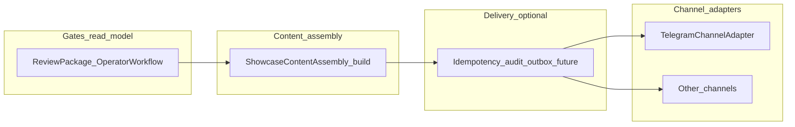

# B13A — Channel adapter design (showcase publishing)

**Project:** Tours_BOT. **Status:** design only — **no** implementation in this slice.

**Related:** [`docs/B12_SHOWCASE_MARKETING_TEMPLATE_LIBRARY.md`](B12_SHOWCASE_MARKETING_TEMPLATE_LIBRARY.md) · [`docs/ADMIN_SHOWCASE_PUBLISH_RUNBOOK.md`](ADMIN_SHOWCASE_PUBLISH_RUNBOOK.md) · [`docs/ADMIN_OPERATOR_WORKFLOW.md`](ADMIN_OPERATOR_WORKFLOW.md) · [`docs/B7_4A_MEDIA_STORAGE_PIPELINE_READINESS_AUDIT.md`](B7_4A_MEDIA_STORAGE_PIPELINE_READINESS_AUDIT.md) · [`docs/B7_4B_MEDIA_STORAGE_INGESTION_CONTRACT.md`](B7_4B_MEDIA_STORAGE_INGESTION_CONTRACT.md) · [`docs/HANDOFF_B13A_CHANNEL_ADAPTER_DESIGN_TO_NEXT_STEP.md`](HANDOFF_B13A_CHANNEL_ADAPTER_DESIGN_TO_NEXT_STEP.md).

---

## 1. Purpose

Showcase publishing must stay **safe** as more surfaces appear. A **channel adapter** layer separates:

- **What** is published (canonical content, already passing admin and policy gates) from **how** it is delivered (Telegram Bot API, future APIs, or manual copy flows).

Without this boundary, teams tend to merge **content generation**, **approval**, **media rendering**, **network I/O**, **retries**, **conversion links**, and **analytics** into one fragile path—raising the risk of duplicate posts, truth drift, or bypassing moderation.

**Future channel examples** (B13A does **not** implement them):

- Telegram channel (today’s baseline).
- Telegram group.
- WhatsApp broadcast / manual copy export.
- Facebook / Instagram manual copy.
- Website / blog card.
- Email / newsletter.
- Partner feeds.

---

## 2. Core principles

- The channel adapter publishes **approved content only** (per product-defined “ready to publish” state—not the adapter’s own judgment).
- The channel adapter **does not decide business truth** (price, inventory, dates, program—that stays on **`SupplierOffer`** and related models).
- The channel adapter **does not approve** content or packaging.
- The channel adapter **does not create** a **`Tour`** or conversion-chain side effects beyond what the orchestration layer already prescribes.
- The channel adapter **does not create** booking, order, or payment rows (Layer A stays separate).
- The channel adapter **does not invent** discounts, seat scarcity, or urgency.
- The channel adapter **does not bypass** **`media_review`** / publish-safe rules enforced upstream.
- The channel adapter **does not bypass** the read-model intent of **`operator_workflow.actions.publish_showcase_channel`** for the **primary** Telegram showcase UX (operators should still see the same **enabled/disabled** semantics before calling publish).
- The adapter layer must be **idempotent** where repeat delivery is harmful, or **explicitly non-retryable** (surface failure to orchestration; avoid blind retries that duplicate channel posts).

---

## 3. Existing Telegram baseline

**Human / read-model gate (Telegram):** **`app/services/supplier_offer_operator_workflow.py`** exposes **`publish_showcase_channel`** with C2B8A cover hard reasons; admin bot **C2B8B** proposes publish only when that action is **enabled**, with confirmation and re-read of review-package.

**HTTP `POST /admin/supplier-offers/{offer_id}/publish`:** Enforces **`lifecycle_status == approved`**, channel + bot token config, then:

```text
SupplierOfferModerationService.publish
  → build_showcase_publication(row, settings)
  → send_showcase_publication(bot_token, chat_id, caption_html, photo_url)
  → persist lifecycle PUBLISHED + showcase_chat_id + showcase_message_id
```

- **Preview** path: **`showcase_preview`** uses **`build_showcase_publication`** only—**no** Telegram I/O.
- **Send:** **`app/services/telegram_showcase_client.py`** — **`send_showcase_publication`**: **sendPhoto** + HTML caption when **`photo_url`** is set; otherwise **sendMessage** with HTML and **`disable_web_page_preview=True`** for text-only.

**B12 note:** **`build_showcase_publication`** does **not** yet consume **`showcase_marketing_template_library_v1`**; **effective template** wiring is a **future content-assembly** concern, not a transport-layer shortcut.

---

## 4. Target layering (future implementation)



- **Gates:** unchanged semantics; adapter never re-derives “can publish.”
- **Assembly:** produces a **neutral publication payload** (caption HTML, optional photo reference, flags, CTA URLs from config)—**no** per-channel HTML hacks inside adapters.
- **Outbox / audit (optional later):** dedupe keys, attempt log, retry policy—design-only in B13A.
- **Adapters:** map payload → platform API or export string; return **channel receipt** (e.g. message id).

---

## 5. Contract sketch (normative for B13B+)

Conceptual types (names illustrative):

- **Input:** offer id + immutable snapshot references + settings + **already-validated** “publish allowed” decision from orchestration.
- **Output:** success with **opaque channel ids** or **terminal failure** (retryable vs non-retryable classification).

B13B should introduce a **Telegram wrapper** that wraps today’s **`send_showcase_publication`** with **no** behavior change.

---

## 6. Media (B7.4D)

Pipeline is **paused** before durable rendered card integration. Adapters must accept **today’s** **`photo_url`** shapes (`telegram_photo:…`, HTTPS URL) and future **stable asset** URLs without weakening B7.x review rules—see [`docs/B7_4A_MEDIA_STORAGE_PIPELINE_READINESS_AUDIT.md`](B7_4A_MEDIA_STORAGE_PIPELINE_READINESS_AUDIT.md).

---

## 7. Conversion and Layer A

Deep links in captions (**bot** + **Mini App** base URL) are **assembled in the content step**; adapters **emit** them only. No booking/payment calls from adapters. Conversion ordering stays as documented in ops runbooks and conversion smoke docs.

---

## 8. Explicit non-goals (B13A)

- No new HTTP routes, no migrations, no new channels shipped.
- No change to **`POST …/publish`** behavior until a follow-up (e.g. **B13B**) explicitly implements a refactor **with regression tests**.
- No Mini App, booking, payment, or order semantics changes.
