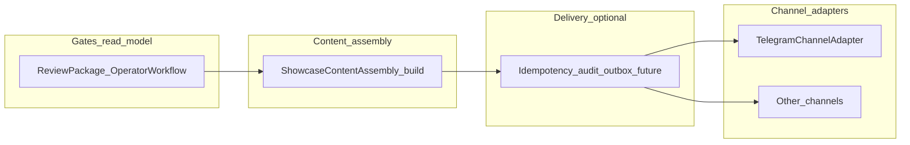

# B13 — Channel adapter design & implementation (showcase publishing)

**Project:** Tours_BOT. **B13A:** design-only. **B13B:** behavior-preserving adapter + Telegram wrapper (**implemented**).

**Related:** [`docs/B12_SHOWCASE_MARKETING_TEMPLATE_LIBRARY.md`](B12_SHOWCASE_MARKETING_TEMPLATE_LIBRARY.md) · [`docs/ADMIN_SHOWCASE_PUBLISH_RUNBOOK.md`](ADMIN_SHOWCASE_PUBLISH_RUNBOOK.md) · [`docs/ADMIN_OPERATOR_WORKFLOW.md`](ADMIN_OPERATOR_WORKFLOW.md) · [`docs/B7_4A_MEDIA_STORAGE_PIPELINE_READINESS_AUDIT.md`](B7_4A_MEDIA_STORAGE_PIPELINE_READINESS_AUDIT.md) · [`docs/B7_4B_MEDIA_STORAGE_INGESTION_CONTRACT.md`](B7_4B_MEDIA_STORAGE_INGESTION_CONTRACT.md) · [`docs/HANDOFF_B13A_CHANNEL_ADAPTER_DESIGN_TO_NEXT_STEP.md`](HANDOFF_B13A_CHANNEL_ADAPTER_DESIGN_TO_NEXT_STEP.md) · [`docs/HANDOFF_B13B_CHANNEL_ADAPTER_INTERFACE_TELEGRAM_WRAPPER_TO_NEXT_STEP.md`](HANDOFF_B13B_CHANNEL_ADAPTER_INTERFACE_TELEGRAM_WRAPPER_TO_NEXT_STEP.md) · **[`docs/B13C_PUBLISH_ATTEMPT_AUDIT_DESIGN.md`](B13C_PUBLISH_ATTEMPT_AUDIT_DESIGN.md)** (publish attempt / audit — design **+** B13D implementation notes) · [`docs/HANDOFF_B13D_ALT_CHANNEL_PREVIEW_PAYLOAD_READ_MODEL_TO_NEXT_STEP.md`](HANDOFF_B13D_ALT_CHANNEL_PREVIEW_PAYLOAD_READ_MODEL_TO_NEXT_STEP.md) · [`docs/HANDOFF_B13D_PUBLISH_ATTEMPT_TABLE_SKELETON_TO_NEXT_STEP.md`](HANDOFF_B13D_PUBLISH_ATTEMPT_TABLE_SKELETON_TO_NEXT_STEP.md).

**B13C pointer:** **[`docs/B13C_PUBLISH_ATTEMPT_AUDIT_DESIGN.md`](B13C_PUBLISH_ATTEMPT_AUDIT_DESIGN.md)** records the publish **attempt / idempotency / audit** model. **B13D** added the **persistent attempt table skeleton** (**not** wired into **`publish`** yet). **Next:** **B13E**+ can wire attempts and idempotency with explicit product approval.

**B13D-alt pointer (implemented):** Read-only **`GET /admin/supplier-offers/{offer_id}/showcase-channel-payload`** exposes **`AdminSupplierOfferShowcaseChannelPayloadRead`** derived from **`build_showcase_publication`** and **`telegram_showcase_channel_publish_request_preview`** — same logical **`ShowcaseChannelPublishRequest`** as **`publish`**, **no** Telegram send, **no** publish behavior or readiness change, **no** idempotency enforcement. See **§9b**.

**B13D pointer (table skeleton, implemented):** **`supplier_offer_showcase_publish_attempts`** + repository + **`SupplierOfferShowcasePublishAttemptService`** — **no** live **`publish`** integration; adapter path **unchanged**; **no** retry/idempotency enforcement yet. See **§9c**.

---

## 1. Purpose

Showcase publishing must stay **safe** as more surfaces appear. A **channel adapter** layer separates:

- **What** is published (canonical content, already passing admin and policy gates) from **how** it is delivered (Telegram Bot API, future APIs, or manual copy flows).

Without this boundary, teams tend to merge **content generation**, **approval**, **media rendering**, **network I/O**, **retries**, **conversion links**, and **analytics** into one fragile path—raising the risk of duplicate posts, truth drift, or bypassing moderation.

**Future channel examples** (not all shipped; **B13B** delivers **Telegram channel** adapter only — see **§9**):

- Telegram channel (today’s baseline).
- Telegram group.
- WhatsApp broadcast / manual copy export.
- Facebook / Instagram manual copy.
- Website / blog card.
- Email / newsletter.
- Partner feeds.

---

## 2. Core principles

- The channel adapter publishes **approved content only** (per product-defined “ready to publish” state—not the adapter’s own judgment).
- The channel adapter **does not decide business truth** (price, inventory, dates, program—that stays on **`SupplierOffer`** and related models).
- The channel adapter **does not approve** content or packaging.
- The channel adapter **does not create** a **`Tour`** or conversion-chain side effects beyond what the orchestration layer already prescribes.
- The channel adapter **does not create** booking, order, or payment rows (Layer A stays separate).
- The channel adapter **does not invent** discounts, seat scarcity, or urgency.
- The channel adapter **does not bypass** **`media_review`** / publish-safe rules enforced upstream.
- The channel adapter **does not bypass** the read-model intent of **`operator_workflow.actions.publish_showcase_channel`** for the **primary** Telegram showcase UX (operators should still see the same **enabled/disabled** semantics before calling publish).
- The adapter layer must be **idempotent** where repeat delivery is harmful, or **explicitly non-retryable** (surface failure to orchestration; avoid blind retries that duplicate channel posts).

---

## 3. Existing Telegram baseline

**Human / read-model gate (Telegram):** **`app/services/supplier_offer_operator_workflow.py`** exposes **`publish_showcase_channel`** with C2B8A cover hard reasons; admin bot **C2B8B** proposes publish only when that action is **enabled**, with confirmation and re-read of review-package.

**HTTP `POST /admin/supplier-offers/{offer_id}/publish`:** Enforces **`lifecycle_status == approved`**, channel + bot token config, then:

```text
SupplierOfferModerationService.publish
  → build_showcase_publication(row, settings)
  → TelegramShowcaseChannelAdapter.publish(ShowcaseChannelPublishRequest(...))
       → send_showcase_publication(bot_token, chat_id, caption_html, photo_url)
  → persist lifecycle PUBLISHED + showcase_chat_id + showcase_message_id
```

- **Preview** path: **`showcase_preview`** uses **`build_showcase_publication`** only—**no** Telegram I/O.
- **Send:** **`app/services/telegram_showcase_client.py`** — **`send_showcase_publication`**: **sendPhoto** + HTML caption when **`photo_url`** is set; otherwise **sendMessage** with HTML and **`disable_web_page_preview=True`** for text-only.

**B12 note:** **`build_showcase_publication`** does **not** yet consume **`showcase_marketing_template_library_v1`**; **effective template** wiring is a **future content-assembly** concern, not a transport-layer shortcut.

---

## 4. Target layering (future implementation)



- **Gates:** unchanged semantics; adapter never re-derives “can publish.”
- **Assembly:** produces a **neutral publication payload** (caption HTML, optional photo reference, flags, CTA URLs from config)—**no** per-channel HTML hacks inside adapters.
- **Outbox / audit (optional later):** dedupe keys, attempt log, retry policy—design-only in B13A.
- **Adapters:** map payload → platform API or export string; return **channel receipt** (e.g. message id).

---

## 5. Contract sketch (normative for B13B+)

Conceptual types (names illustrative):

- **Input:** offer id + immutable snapshot references + settings + **already-validated** “publish allowed” decision from orchestration.
- **Output:** success with **opaque channel ids** or **terminal failure** (retryable vs non-retryable classification).

B13B **implemented** a **Telegram-only** wrapper with regression tests; see **§9**. Further channels, outbox, and publish-attempt storage remain **future**.

---

## 9. B13B (implemented) — adapter interface + Telegram wrapper

- **Module:** **`app/services/showcase_channel_adapter.py`**
- **DTOs:** **`ShowcaseChannelPublishRequest`** (`offer_id`, **`ShowcasePublication`**, optional `channel_ref` / `idempotency_key`); **`ShowcaseChannelPublishResult`** (`provider`, `chat_id`, `message_id` string, optional `raw_reference`).
- **Contract:** **`ShowcaseChannelAdapter`** — sync **`publish(request) -> result`** (matches existing synchronous moderation path).
- **Telegram:** **`TelegramShowcaseChannelAdapter`** delegates to **`send_showcase_publication`** with the same arguments as before B13B.
- **Orchestration:** **`SupplierOfferModerationService.publish`** builds **`ShowcasePublication`** via **`build_showcase_publication`**, calls the adapter with **`channel_ref`** = configured channel id, then persists **`showcase_chat_id`**, **`showcase_message_id`**, lifecycle **`published`** as before.
- **Unchanged:** **`build_showcase_publication`**; **`operator_workflow`** / review-package gates; admin C2B8B flow; **no** publish readiness or caption/photo behavior change; **no** outbox or publish-attempt persistence; **no** additional channels shipped.
- **Tests:** regression on moderation publish + Telegram admin publish + adapter unit test (see **[`docs/HANDOFF_B13B_CHANNEL_ADAPTER_INTERFACE_TELEGRAM_WRAPPER_TO_NEXT_STEP.md`](HANDOFF_B13B_CHANNEL_ADAPTER_INTERFACE_TELEGRAM_WRAPPER_TO_NEXT_STEP.md)**).

---

## 9b. B13D-alt (implemented) — read-only channel payload preview

- **HTTP:** **`GET /admin/supplier-offers/{offer_id}/showcase-channel-payload`** (same admin auth as **`/showcase-preview`**).
- **Read models:** **`AdminShowcasePublicationPayloadRead`**, **`AdminSupplierOfferShowcaseChannelPayloadRead`** in **`app/schemas/supplier_admin.py`**.
- **Service:** **`SupplierOfferModerationService.showcase_channel_payload_preview`** uses **`build_showcase_publication`** and **`telegram_showcase_channel_publish_request_preview`** — **no** Telegram I/O, **no** DB writes.
- **Semantics:** Payload matches the logical **`ShowcaseChannelPublishRequest`** used on **`publish`** ( **`idempotency_key`** remains **`null`** until B13C+ implementation).
- **Unchanged:** **`POST …/publish`**, **`send_showcase_publication`**, publish readiness, **no** migrations / attempt table / retries.

Handoff: **[`docs/HANDOFF_B13D_ALT_CHANNEL_PREVIEW_PAYLOAD_READ_MODEL_TO_NEXT_STEP.md`](HANDOFF_B13D_ALT_CHANNEL_PREVIEW_PAYLOAD_READ_MODEL_TO_NEXT_STEP.md)**.

---

## 9c. B13D (implemented) — publish attempt table skeleton (unwired)

- **Table / ORM:** **`supplier_offer_showcase_publish_attempts`** — **`SupplierOfferShowcasePublishAttempt`**; migration **`20260531_29`**
- **Service layer:** **`SupplierOfferShowcasePublishAttemptService`** + repository — create/mark status transitions only; **not** called from **`SupplierOfferModerationService.publish`** in this slice.
- **Retention:** FK **`ON DELETE RESTRICT`** (not CASCADE) — operational child tables on **`supplier_offers`** (e.g. tour bridge, execution links) still use CASCADE; **publish attempts** are **audit** rows and are **not** silently removed when an offer is deleted.
- **Unchanged:** **`TelegramShowcaseChannelAdapter`**, **`send_showcase_publication`**, publish readiness, **no** automatic retry, **no** idempotency key enforcement.

Handoff: **[`docs/HANDOFF_B13D_PUBLISH_ATTEMPT_TABLE_SKELETON_TO_NEXT_STEP.md`](HANDOFF_B13D_PUBLISH_ATTEMPT_TABLE_SKELETON_TO_NEXT_STEP.md)**.

---

## 10. Media (B7.4D)

Pipeline is **paused** before durable rendered card integration. Adapters must accept **today’s** **`photo_url`** shapes (`telegram_photo:…`, HTTPS URL) and future **stable asset** URLs without weakening B7.x review rules—see [`docs/B7_4A_MEDIA_STORAGE_PIPELINE_READINESS_AUDIT.md`](B7_4A_MEDIA_STORAGE_PIPELINE_READINESS_AUDIT.md).

---

## 11. Conversion and Layer A

Deep links in captions (**bot** + **Mini App** base URL) are **assembled in the content step**; adapters **emit** them only. No booking/payment calls from adapters. Conversion ordering stays as documented in ops runbooks and conversion smoke docs.

---

## 12. Explicit non-goals (cumulative)

**B13A (design):** No speculative multi-channel product in the design doc alone.

**B13B (implemented refactor):** **No** change to publish **readiness**, **output**, or **external** **`POST …/publish`** contract beyond delegating the send through **`TelegramShowcaseChannelAdapter`**; **no** outbox, **no** publish-attempt table, **no** migrations, **no** new non-Telegram channels, **no** Mini App / booking / payment / order changes.

**Still future / explicit product gates:** **B13E+** — wire attempt rows into **`publish`** and optional idempotency (product-approved); **B13D-alt** (**read-only channel payload** endpoint) **implemented** — does **not** replace audit storage; additional channel adapters; **B12** effective template in **`build_showcase_publication`**, B7.4+ durable rendered assets.
