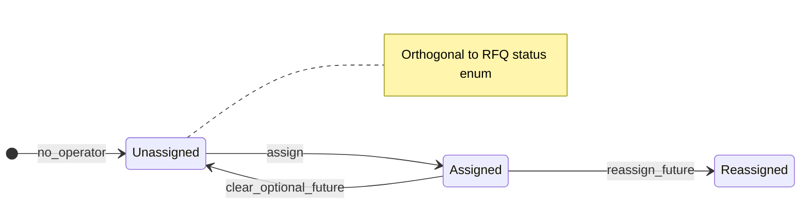

# Operator Assignment Gate (Custom Requests / RFQ)

**Phase:** Y36.1 (docs-only)  
**Depends on:** Y35 (admin read visibility, Telegram admin UI, customer summary on admin surfaces) — accepted for read-side.

This gate designs a **safe assignment model** for **custom marketplace requests only** (Layer C RFQ). It does **not** add runtime code, routes, or migrations in this document. Implementation must be a **separate** explicitly scoped runtime slice.

**Scope boundary:** Custom requests / RFQ only. **Not** bookings/orders assignment (Layer A), **not** execution-link workflow changes.

---

## 1. Current state

- `CustomMarketplaceRequest` rows have a customer `user_id`, lifecycle **`status`** ([`CustomMarketplaceRequestStatus`](app/models/enums.py)), commercial/bridge-related fields, and operational hints on admin read paths — but **no operator owner** column.
- Y35.2/Y35.3 added **read-only** admin API and Telegram admin lists/detail for requests; Y35.5 added **`customer_summary`** on admin read DTOs for operator-facing labels.
- Operators can **see** all requests (within admin auth) but cannot **claim, assign, or hand off** work in-product; triage is informal (outside the app) unless/until this gate is implemented.

---

## 2. Assignment model

- **Owner** is distinct from the **customer** (`user_id`): it is the internal **operator** responsible for follow-up on the admin/ops side.
- **Recommended persistence (runtime):** `assigned_operator_id` as a **nullable FK to `users.id`**, mirroring [`Order.assigned_operator_id`](app/models/order.py) and [`Handoff.assigned_operator_id`](app/models/handoff.py). **Do not** store raw Telegram user id as the sole foreign key in the database; resolve `User.telegram_user_id` for display when needed.
- **Unassigned:** `assigned_operator_id IS NULL`.
- **Assigned:** `assigned_operator_id` set to a valid `users.id` representing an operator account.
- **Orthogonality:** Assignment is **not** a replacement for `status`. A request can be `open` and unassigned, or `open` and assigned, etc. Future phases may **correlate** assignment with status (e.g. auto `under_review`) only under an explicit follow-up gate — not assumed here.

---

## 3. States (conceptual)

Two independent dimensions:

| Dimension | Meaning |
|-----------|--------|
| **Assignment** | Unassigned vs assigned (`assigned_operator_id` null vs non-null). |
| **Lifecycle** | Existing enum: e.g. `open`, `under_review`, supplier selection / closed variants, etc. |

**Future-facing labels (documentation only, not required in first slice):**

- *in_progress*, *resolved*, *closed* as **operational** or **derived** labels may be added later (separate enum values, flags, or reporting views). They are **out of scope** for the first runtime slice unless only documented as postponed.

---

## 4. Allowed transitions (full vision)

| From | To | Guardrails |
|------|-----|------------|
| Unassigned | Assigned (me or another operator) | Admin/ops only; request must be **visible** on admin read rules. |
| Assigned | Reassigned (different operator) | Admin/ops only; not allowed in first slice. |
| Assigned | Unassigned (clear) | Admin/ops only; optional product decision; not allowed in first slice. |

- **Terminal / closed** request records: assignment mutations should be **rejected** or **no-ops** with a clear error (define at implementation: e.g. no assign after `fulfilled` / certain closed states).
- **Reassign** and **unassign** are **postponed** until after the first “assign to me” slice is accepted.

---

## 5. UI (Telegram) — target

- **List/detail:** show **current owner** when assigned (operator display string using the same `User`-backed pattern as customer summary where appropriate: display name, `@username`, or `tg:{telegram_user_id}` for the **operator** `User` row). When unassigned, show an explicit “Unassigned” (or equivalent) line.
- **Actions (vision):** **Assign to me**, **Reassign** (choose operator — future), **Clear assignment** (future).
- **First runtime slice:** **Assign to me** only: one button, no reassign, no unassign, minimal new `callback_data` (stay within Telegram 64-byte limit; no PII in callbacks).

**Admin API:** complement Telegram with a single **idempotent** admin-authenticated endpoint (see §9).

---

## 6. Permissions

- **Only** central admin/ops surfaces: same **admin API token** and **Telegram allowlist** model as Y35.3 (fail-closed; no access without verified admin identity).
- **No** customer Mini App or self-service actions: customers must not assign, claim, or see other users’ assignment state beyond their own request as today.
- **Suppliers** remain supplier-scoped; no global request assignment in supplier routes unless a future gate explicitly extends scope.
- **“Assign to me”:** resolve the actor from the **Telegram user id** of the allowlisted admin message/callback, map to `users.id`, and set `assigned_operator_id` to that row (or 403 if no matching `User` / not allowed).

---

## 7. Audit

- **Minimum (recommended for first implementation):** `assigned_at` (timestamp, set on each successful assign); optionally `assigned_by_user_id` (for “assign to me”, typically same as `assigned_operator_id`).
- **Full history** (append-only assignment events) — **postponed**; document requirement if compliance needs an immutable log later.

**Migration note:** New nullable columns on `custom_marketplace_requests` (and indexes as needed) are **additive** and do not change meaning of existing columns. Justify in the implementation PR; this gate only records that a migration is **expected** for persistence, not a separate “design-only” alternative that skips DB truth.

---

## 8. Fail-safe

- **Visibility:** cannot assign a request the caller cannot read on admin (404/403 as today).
- **Idempotency:** “Assign to me” when **already** assigned to the same operator should either succeed with no net change (200) or return a clear conflict — choose one policy at implementation; must not create duplicate state rows.
- **No breaking changes:** does not alter RFQ **commercial resolution**, **booking bridge** creation rules, **supplier response** mechanics, or **Layer A** booking/payment.
- **Privacy:** no new cross-user data on Mini App; no leak of other customers’ operator assignment in customer routes.
- **Invalid actor** (e.g. no `User` row for Telegram id): **fail closed**, no partial updates.

---

## 9. First safe runtime slice (recommendation)

1. **Schema (additive):** `assigned_operator_id` → `users.id` (nullable FK), `assigned_at` (nullable timestamptz), optional `assigned_by_user_id` (nullable FK to `users.id`).
2. **API:** e.g. `POST /admin/custom-requests/{request_id}/assign-to-me` (or narrow `PATCH` body) under existing admin auth — **only** this mutation; no reassign/unassign.
3. **Service:** single transaction; validate request exists and is in an assignable state; set operator from current admin identity; populate audit fields.
4. **Telegram:** one **Assign to me** control on admin request detail (and optionally list); show owner line after assign; **no** new FSM complexity beyond a direct handler or thin callback.
5. **Out of first slice:** reassign, unassign, `in_progress` / resolved / close-from-assignment, history table, bulk assign.

---

## 10. Tests required (future implementation)

- **API:** success path; 401 without admin token; 404 unknown request; optional 409/400 when assign not allowed (terminal state); idempotent policy for “already assigned to me.”
- **Telegram:** allowlisted only; message shows assigned operator summary; `callback_data` length and **no** embedded PII beyond numeric ids.
- **Regression:** `GET /mini-app/custom-requests` and per-user detail **unchanged** (user-scoped, no assignment fields to customers); supplier routes unchanged; no booking/payment or execution-link test churn except proving unrelated modules untouched.

---

## Constraint summary (this gate)

- **Docs only** in this phase: no app code, no migrations in-repo from this document alone.
- **No** booking/payment, **no** Mini App customer changes, **no** execution-link changes, **no** identity bridge changes.
- **Preserve** the Y35 **customer privacy** model (`My requests` current-user only).
- **Bookings/orders** operator assignment is **explicitly out of scope**; may align conceptually with `Order.assigned_operator_id` in a **future** gate if product requires parity.
