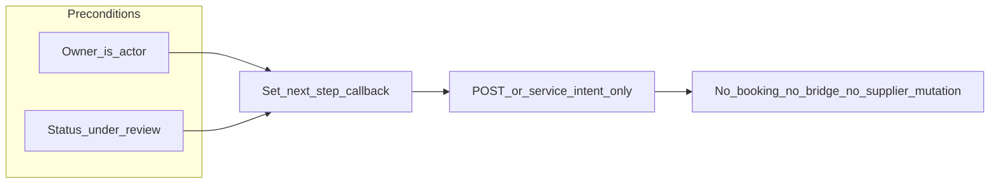

# Operator Decision Gate (Custom Marketplace Requests / RFQ)

**Phase:** Y37.3 (docs-only design gate)  
**Depends on:**  
- [`docs/OPERATOR_ASSIGNMENT_GATE.md`](OPERATOR_ASSIGNMENT_GATE.md) (assignment model)  
- [`docs/OPERATOR_WORKFLOW_GATE.md`](OPERATOR_WORKFLOW_GATE.md) (Y37.1: assignment vs lifecycle; `open` → `under_review`)  
- **Y36.2–Y36.5** accepted: assign-to-me, ORM, Telegram owner UI  
- **Y37.2** accepted: **`POST /admin/custom-requests/{id}/mark-under-review`** with **`X-Admin-Actor-Telegram-Id`**; Telegram **Mark under review** when **Owner = you** and **status = open**; leaves assignment unchanged; no booking/payment/bridge/supplier/Mini App side effects

This gate designs the **next safe operator decision layer** **after** the request is in **`under_review`**: recording **what the team should do next** (coordination intent) **without** turning that into automatic commercial or Layer A side effects.

**Scope:** **Custom marketplace requests only** (Layer C RFQ). **Not** Mini App customer surfaces, **not** supplier-admin RFQ push/broadcast, **not** order/booking/payment creation, **not** `custom_request_booking_bridges`, **not** `supplier_offer_execution_links`, **not** identity bridge.

**This document does not add** runtime code, migrations, API routes, Telegram handlers, or tests.

---

## 1. Current accepted state (post–Y37.2)

| Area | Truth |
|------|--------|
| **Assignment** | `assigned_operator_id` / `assigned_by_user_id` are **`users.id`**; orthogonal to status ([`OPERATOR_ASSIGNMENT_GATE.md`](OPERATOR_ASSIGNMENT_GATE.md)). |
| **Lifecycle** | Operator may move **`open` → `under_review`** (Y37.2) when **assigned to current actor** only. |
| **`under_review` footprint** | Y37.2 changes **only** `CustomMarketplaceRequest.status` for that transition; no assignment, booking, payment, bridge, supplier route, or Mini App scoping changes. |
| **Downstream operator decision** | There is **no** first-class, machine-readable “next step / intent” field for ops after `under_review` in this baseline (only free-text **`admin_intervention_note`** and existing admin **`PATCH`**, if used elsewhere). |

---

## 2. Decision goal

Enable the **assigned** operator, while the case is in **`under_review`**, to record a **clear, explicit** choice about **what should happen next** (e.g. wait for suppliers vs internal follow-up) for **team coordination and reporting**, **without**:

- auto-creating **bookings, orders, tours, or payments**;
- auto-creating **bridges** or **execution links**;
- **broadcasting** or **nudging** suppliers beyond existing product rules;
- **changing** customer Mini App list/detail or sending **customer-visible** notifications in this track.

**Principle:** **Lifecycle `status`** (e.g. `under_review`) remains the **customer/commercial** stage when relevant; **operator intent** (“what we are doing about it next”) should remain **separate** where possible, so the enum is not overloaded with ten overlapping meanings.

---

## 3. First decision options (product) vs first runtime slice

**Product may eventually** support, among others (names illustrative):

| Intent (illustrative) | Meaning (high level) |
|------------------------|----------------------|
| **Need supplier offer** | Primary path is to obtain/see supplier responses; ops expects RFQ-side progress (without implying auto-send in this gate). |
| **Need manual follow-up** | Internal/ops follow-up (phone, CRM, handoff) is the main next step, not a new automated supplier action. |
| **Not serviceable / close later** | Leads toward **resolve/close** semantics — **out of this gate’s first slice**; overlaps **resolution/terminal** tracks and must not be the first “decision” button. |

A **future Y37.4+** implementation should ship **one** narrow decision in **v1** (a single allowed enum value in the first endpoint body, or a two-value enum where only one is enabled by config), then add more values in **later** iterations. **“Not serviceable / close later”** stays **postponed** until a **resolve/close** or **resolution** gate is explicit.

---

## 4. Data model options

**Grounding:** [`CustomMarketplaceRequest`](../app/models/custom_marketplace_request.py) has **`status`** (lifecycle) and **`admin_intervention_note`** (free text).

| Approach | Pros | Cons |
|----------|------|------|
| **A — Encode intent in `admin_intervention_note`** (e.g. fixed prefix) | No migration. | Collides with human/admin **PATCH** edits; hard to query; error-prone. **Not recommended** for a durable operator workflow. |
| **B — Additive columns (recommended for a clean runtime)** | Machine-readable, queryable, auditable: e.g. nullable **enum** `operator_workflow_intent` (or similar) + `operator_workflow_intent_set_at` + `operator_workflow_intent_set_by_user_id` (names **illustrative**). | Requires **one** Alembic revision in the implementation track; must stay **nullable** and backward-compatible. |
| **C — New `status` values** for each intent | Reuses one column. | **Overloads** lifecycle with “what ops is doing” vs “what the customer/supplier state is”; conflicts with **resolution** and **supplier_selected** semantics. **Avoid** unless a later product gate rewrites the enum story. |

**Recommendation:** keep **`under_review`** as the status while this decision exists in **v1**; persist intent via **(B)** additive fields **or** a single additive enum column if a separate timestamp/actor is deferred (still **additive-only**). **Do not** add columns to `orders`/`payments`/`tours` in this feature.

---

## 5. Recommended first runtime slice (Y37.4+; not in Y37.3)

**Narrow v1 (example for a future implementation ticket):**

- **One** admin endpoint, e.g. **`POST /admin/custom-requests/{request_id}/operator-decision`**
- **Actor:** same as Y36/Y37.2: header **`X-Admin-Actor-Telegram-Id`** → `User` → `users.id`
- **Body (v1):** e.g. `{ "decision": "need_supplier_offer" }` **or** `{ "decision": "need_manual_followup" }` — **implementation should enable exactly one of these** in the first release (the other can follow in a follow-up micro-slice; **do not** ship all three product intents in one go if it increases test surface without need).
- **Preconditions:** `assigned_operator_id == actor_user_id`, **`status == under_review`**, not terminal; **rejects** if unassigned, wrong operator, or wrong status.
- **Effect:** persist intent only (per §4); **idempotent** success if same **decision** and same **actor** (or same stored value).
- **Does not** change `status` in **v1** if intent is stored separately (keeps Y37.2 and resolution paths simple).

**Safer first single value (pick in implementation spec):** prioritize **`need_manual_followup`** *or* **`need_supplier_offer`** as the **only** allowed enum member in v1, based on which coordination path the org needs first; the gate does not mandate the choice — the **Y37.4** ticket must lock one.

---

## 6. Permissions

| Rule | Behavior |
|------|------------|
| **Actor** | **Must** be the **assigned** operator (`assigned_operator_id == actor.id`). |
| **Unassigned** | **Block** (no mutation). |
| **Assigned to another user** | **Block** (same **conflict** family as assign / mark-under-review). |
| **Status** | **Must** be **`under_review`** for this action in v1 (not `open` without prior mark, not terminal/closed). |
| **Admin API token** | Same as other `/admin/custom-requests/*` **mutations**; actor header required for “who is deciding.” |
| **Telegram** | Allowlisted admin/operator only; same boundary as Y35.3 / Y36 / Y37.2. |
| **Customer / supplier** | Unchanged: **no** new supplier routes, **no** Mini App all-requests visibility. |

---

## 7. Telegram UI concept

- **Entry:** on admin request **detail**, show a **“Set next step”** (or similar) **only** when **Owner: you** (or list equivalent) **and** **Status: under_review** (same as Y37.2’s “only when allowed” pattern).
- **Interaction:** one **callback** to open a **second message** with **2–3 inline buttons** (or one screen with one row per option in v1 if only one value is valid — product choice).
- **Callback_data:** **compact** — `request_id` + `page` + **short** decision code (e.g. `od:{id}:{page}:{d}` with `d` in `0/1/2`); **no** names, phones, or free text; **UTF-8 byte length** within Telegram’s **64-byte** limit.
- **After success:** **refresh** detail (new message, same as Y37.2) showing stored intent in admin copy or labels (if exposed on read DTO in implementation).
- **PII:** do not place customer identifiers in callbacks.

---

## 8. Fail-safe behavior

A conforming implementation **must not** (from this feature alone):

1. Create or update **Layer A** **orders** or **bookings** or **tours** automatically.  
2. Create **payment** records or start payment **sessions**.  
3. Create or modify **`custom_request_booking_bridges`**.  
4. Create or change **`supplier_offer_execution_links`**.  
5. **Publish** or **moderate** supplier offers beyond existing flows.  
6. **Invoke** automatic supplier “RFQ send” or notification fan-out (if such exists), unless a **separate** gate and implementation **explicitly** add it.  
7. **Alter** **identity bridge** or customer session semantics.  
8. **Change** customer-facing Mini App list/detail for **“My requests”** (remains user-scoped).  
9. **Send** **customer** Telegram/notification text about this **intent** unless a later gate productizes it.  

**Operator/admin-only** visibility of the intent in **admin** API and Telegram is expected.

---

## 9. Tests required (acceptance for a future implementation PR)

| # | Area |
|---|--------|
| 1 | **API:** success when **assigned to me** + **`under_review`** + valid `decision`. |
| 2 | **API:** **403/400/409** as per project style when **unassigned**, **other assignee**, **not `under_review`**, or **terminal** status. |
| 3 | **API:** **idempotency** (same decision, same actor). |
| 4 | **Telegram:** **“Set next step”** (or equivalent) only when **owner you** + **`under_review`**; **hidden** otherwise. |
| 5 | **Telegram:** callback updates detail; callbacks **≤ 64** bytes. |
| 6 | **Mini App:** `GET /mini-app/custom-requests*` scoping **unchanged**; no new customer fields leaking intent. |
| 7 | **Regression:** no new writes in supplier-offer, order, payment, bridge paths from this endpoint (assert/grep/transaction boundary as appropriate). |

---

## 10. Postponed (separate gates or later iterations)

- **Resolve** / **close** / **cancel** / **admin resolution** and **`supplier_selected`** selection flows.  
- **Supplier RFQ** send, broadcast, or new supplier-visibility rules.  
- **Bridge** and **Layer A** conversion.  
- **Reassign** / **unassign** (see assignment gate).  
- **Customer notifications** and customer-visible status text for “intent.”  
- **Second and third** decision enum values, if v1 only ships one.

---

## 11. Summary

| Item | Choice |
|------|--------|
| **After** | **`under_review`** + **assigned to actor** |
| **Intent vs status** | Prefer **separate** stored intent; **do not** overload lifecycle enum for v1 |
| **First v1** | **One** decision value or **one** endpoint with one allowed value — **no** “close later” in first slice |
| **Next** | **Y37.4+** implementation ticket; **Y37.3** is **docs-only** |
